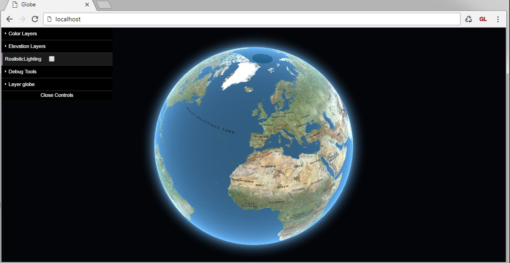
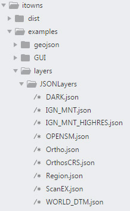
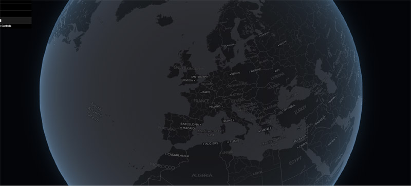
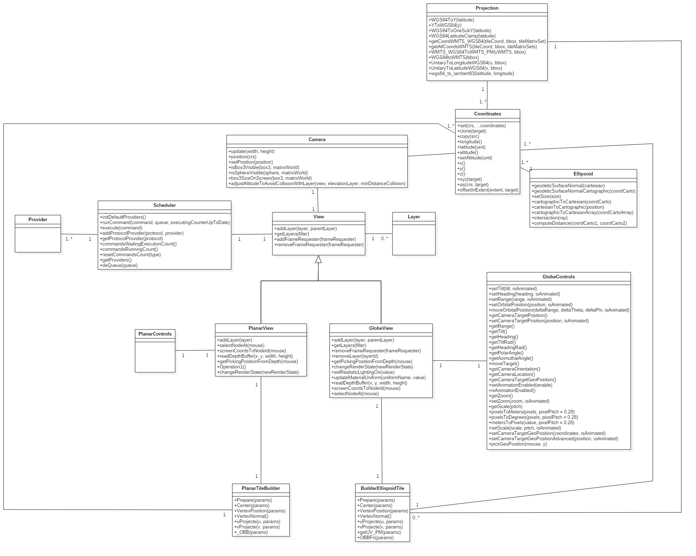
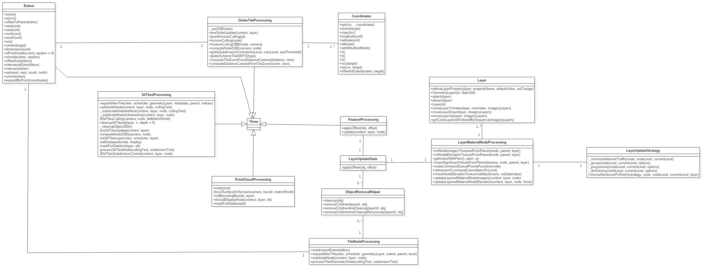
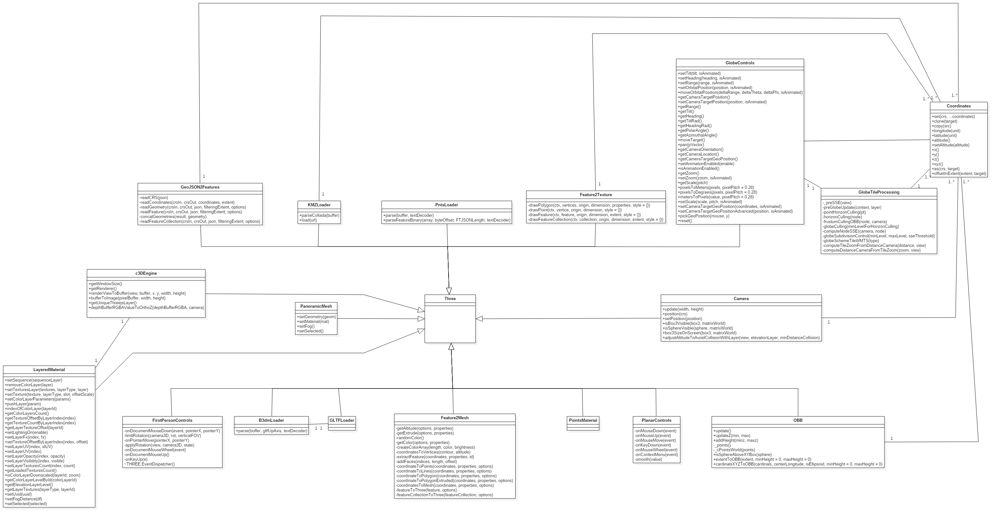
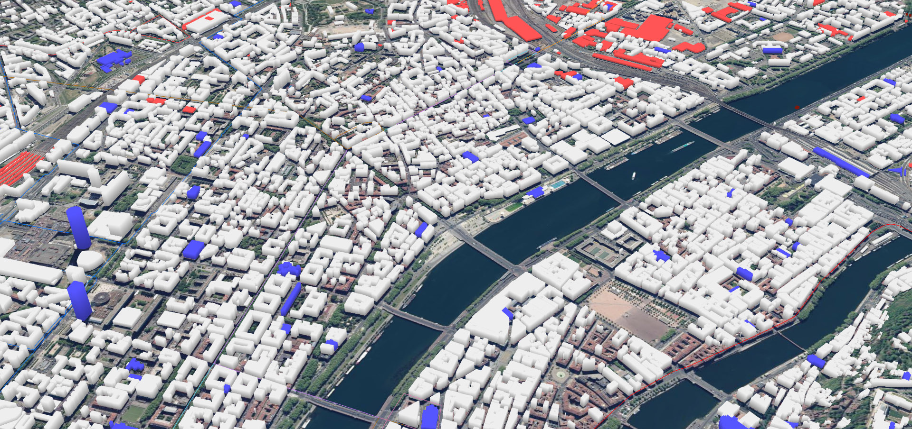
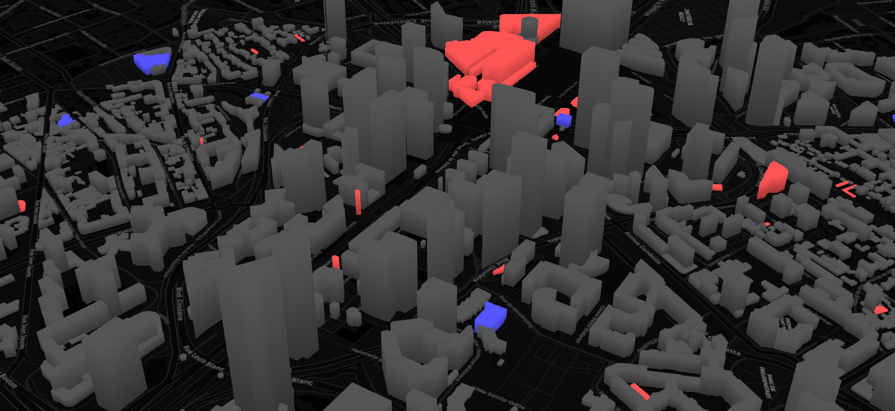
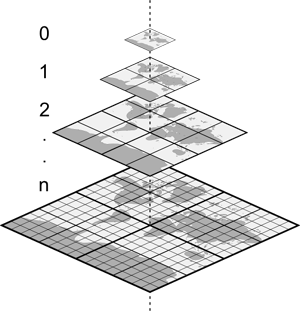
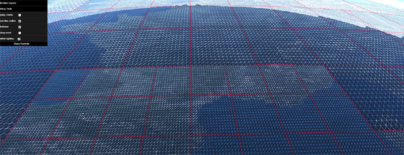


# iTowns Tutorial
Hello and welcome to iTowns community!

This tutorial can be useful for **beginners** in iTowns and Javascript but also for more **experienced users**. We start from scratch with basic setups, then we show how to use the API to display what we want with just few lines of code. Then the last part covers some more evolved visualisation/interaction. Let's start!


# Plan
1. What is it ? | 2. Quick start | 3. Architecture | 4. Using the API | 5. Going Further


## 1. What is it?


iTowns is a Three.js-based framework written in Javascript/WebGL for visualizing **3D geospatial data.**

It can connect to WMS/WMTS/TMS servers including elevation data and load many different data formats (3dTiles, gpx, KML and much much more).

iTowns has been redesigned from this [early version](https://github.com/iTowns/itowns-legacy).


## 2. Quick start

The whole rendering of iTowns relies on WebGL to get the power of the GPU. So the first thing you can do is to verify that your browser supports WebGL. An easy way to do this is to check this iTowns example: 
http://www.itowns-project.org/itowns/examples/globe.html

*If it doesn't work, try to update your browser (It works best on Chrome but it works also fine on Firefox) and your graphic card drivers. You can also check https://get.webgl.org/ to get more information*.


Here we present 3 possible ways to get/use iTowns. You can:
1. Get it through npm  -> getting directly itowns as a module
2. Download a bundle from our github release page -> getting directly itowns as a script JS
3. Get the source and run in using npm  -> the developer way

---
### 1. Get it through npm  -> getting directly itowns as a module
For this solution, you need to get [Node.js](https://nodejs.org) (it comes with its Node Package Manager). Be careful if you are behind a proxy to specify it (https://medium.com/@patdhlk/node-js-and-npm-behind-a-proxy-111708b82718)

In your project root directory:

```bash
npm install --save itowns
```

This package contains the ES6-compatible sources of Itowns.

If you’re using a module bundler (like wepback), you can directly require('itowns') in your code.


### 2. Download a bundle from our github release page -> getting directly itowns as a script JS

We provide a bundle on our [release page](https://github.com/iTowns/itowns/releases) that you can directly include in your html files that exposes itowns in window:

```html
<script src="node_modules/itowns/dist/itowns.js"></script>
```
**/!\ Please note that this bundle also contains the dependencies**.


### 3. Get the source and run it using npm -> the developer way
For this solution, you need to get [Node.js](https://nodejs.org) (it comes with its Node Package Manager). Be careful if you are behind a proxy to specify it (https://medium.com/@patdhlk/node-js-and-npm-behind-a-proxy-111708b82718)

This solution has some advantages as it provides you with the most recent code (last master) and also allows you to code in iTowns with automatic compilation and refresh of your browser.

If you have git :
```bash
git clone https://github.com/iTowns/itowns
```
Or you can directly download the zip containing the source code at https://github.com/iTowns/itowns/archive/master.zip

**Install dependencies**

In your chosen root directory of iTowns:
```bash
npm install
npm start
```
Using npm start is very practical because it'll restart automatically the application everytime you save the sources on modifications

---
You need a webserver to test iTowns locally on your computer. NPM can do it for you but you can also use Apache or Python simple http server or anything else you prefer :)

## 3. Using the API


#### Supported data types

- Aerial imagery
- Elevation model
- Vector
- Meshes

#### Suppported protocols
- WMS
- WMTS
- TMS
- WFS

#### Supported data files formats
- Images:
-- jpg
-- png
- Data:
-- Json
-- GeoJson
-- XML
-- KML
-- GPX

#### API documentation and demo

You can find an API documentation [here](http://www.itowns-project.org/itowns/API_Doc/)
If you want to play with a demonstration, please click [here](http://www.itowns-project.org/itowns/)


#### Let's start with a simple example

We are going to have a look on the *index.html*.

You can launch the *index.html* sample code by accessing your localhost directly. For example, in itowns root directory:

```bash
# if you use npm as a server
npm start
```
Then open your browser with localhost as url (precise the port, default :8080), you should see this:


A globe with 4 different imagery layers and 2 layers for the elevation. Let’s now look at the code producing this visualization: */itowns/index.html*


You can see that we import 4 external scripts. Only **itowns.js** is mandatory


```html
<script src="examples/GUI/dat.gui/dat.gui.min.js"></script>
<script src="examples/GUI/GuiTools.js"></script>
<script src="dist/itowns.js"></script>
<script src="dist/debug.js"></script>
```

- *dat.gui.min.js* : Source code for the menu.
- *GuiTools.js*: Some itowns specific code related to the menu
- *itowns.js*: **itowns source code**
- *debug.js*: Some optional debug functions

**Minimal code**: If we would like to show just the globe without a menu and debug functions and only two layers it would look like this more **simple snippet**:

```html
<html>
    <head>
	    <style type="text/css">
	        html {height: 100%}
	        body { margin: 0; overflow:hidden; height:100%}
            #viewerDiv {margin : auto auto; width: 100%; height: 100%; padding: 0;}
	    </style>
    </head>
    <body>
        <div id="viewerDiv"></div>
        <script src="dist/itowns.js"></script>
        <script type="text/javascript">
            /* global itowns,document,GuiTools*/
            var positionOnGlobe = { longitude: 2.351323, latitude: 48.856712, altitude: 25000000 };
            // iTowns namespace defined here
            var viewerDiv = document.getElementById('viewerDiv');
            var globeView = new itowns.GlobeView(viewerDiv, positionOnGlobe);
            itowns.Fetcher.json('examples/layers/JSONLayers/Ortho.json').then(function(result) { return globeView.addLayer(result); });
            itowns.Fetcher.json('examples/layers/JSONLayers/WORLD_DTM.json').then(function(result) { return globeView.addLayer(result); });
		</script>
    </body>
</html>
```


**Line by line explanation**

First step is to create a HTML div where iTowns will be displayed:

```html
 <div id="viewerDiv"></div>
```

We then import itowns source code (*dist/* is the default directory if used npm run build):

```html
 <div id="dist/itowns.js"></div>
```

Then we enter the code to show the globe. We specify a position to initialize camera position:
```html
 <script type="text/javascript">
            /* global itowns,document,GuiTools*/
            var positionOnGlobe = { longitude: 2.351323, latitude: 48.856712, altitude: 25000000 };
```

We create a GlobeView and specify where to render it (viewerDiv) and the initial camera position (positionOnGlobe):
```javascript
const viewerDiv = document.getElementById('viewerDiv');
const globeView = new itowns.GlobeView(viewerDiv, positionOnGlobe);
```


Finally we tell itowns *GlobeView* what data we want do display. Here we specify two WMTS providers, one for aerial imagery (*ortho.json*) and the other for elevation data (*WORLD_DTM.json*)

```javascript
itowns.Fetcher.json('examples/layers/JSONLayers/Ortho.json').then(function(result) { return globeView.addLayer(result); });
itowns.Fetcher.json('examples/layers/JSONLayers/WORLD_DTM.json').then(function(result) { return globeView.addLayer(result); });
```

Those two JSON comes with others to access specific data. You can play with the few json samples that you can find here: *examples/layers/JSONLayers/*



For the WMTS as for the WMS protocol, the description is standard. Here is the example to display the ortho imagery WMTS from IGN: (Keep in mind that it will work in localhost with the given key but you will need a geoportal key to make it work on a distant server. You create your own key for IGN services [here](http://professionnels.ign.fr/user))

```json
{ 
	 "type": "color",
    "protocol":   "wmts",
    "id":         "Ortho",
    "url":        "http://wxs.ign.fr/(your_geoportal_key)/geoportail/wmts",
    "networkOptions": {
        "crossOrigin": "anonymous"
    },
    "updateStrategy": {
        "type": "0",
        "options": {}
    },
    "options": {
        "attribution" : {
            "name":"IGN",
            "url":"http://www.ign.fr/"
        },
        "name": "ORTHOIMAGERY.ORTHOPHOTOS",
        "mimetype": "image/jpeg",
        "tileMatrixSet": "PM",
    }
}
```

*tileMatrixSetLimits* are optional.

We also incorporated an example for OpenStreetMap (*examples/layers/JSONLayers/OPENSM.json*), even if not following the usual url for wmts, you can use a custom url:  

```javascript
  "customUrl": "http://a.basemaps.cartocdn.com/dark_all/%TILEMATRIX/%COL/%ROW.png"
  ```

  


From the *index.html* you can do many things using the API. You can check the documented functions [here](http://www.itowns-project.org/itowns/API_Doc/)

We try to create demos that represent different functionalities of iTowns so feel free to check some of them [here](http://www.itowns-project.org/itowns/examples/index.html)


## 4. Architecture
Let’s have a look on iTowns architecture. We give here a view with 3 diagrams showing how the code is organized.

**Core**

[*original image size*](img/core.png) 
 


**Process**

[*original image*](img/process.png)




**Renderer**

[*original image*](img/renderer.png)



iTowns is using THREEJS as the graphic library. It is a very powerful library, well documented. Have a look on it here: https://github.com/mrdoob/three.js/
This gives to iTowns a very strong usability and an *easy* start for 3D projects. iTowns is basically relying on THREEJS for all graphics computation, and adds specific algorithms to handle very large scale rendering such as RTC (Relative To Center) for example.


### Important classes:

**Renderer/c3DEngine.js**
- This is the graphic engine of iTowns. It handles the rendering functions, RTC rendering, scene graph.  
Attributes of this class uses some of THREE JS main objects such as:
-- *THREE.WebGLRenderer* -> The main renderer
-- *THREE.WebGLRenderTarget* -> for the picking (to get 3D position on click)

- This class is responsible for the render calls through *this.renderScene*. (Beware when coding that this function is called or you won't see any of your added objects in the scene as iTowns doesn't use a continuous render loop on *requestanimatedframe* for ex.)

**Renderer/ThreeExtended/GlobeControls.js**
- This class controls the camera with the mouse, the keyboard and functions, for example: rotation, tilt, heading etc. by doing `CRTL + Click` or by using functions such as *setTilt()*, *setRange()*, *setCameraTargetGeoPosition()*...

**Core/View.js**
- This class creates an iTowns scene instance. It allows to add layers to the scene and to get layers from the scene.

**Prefab/GlobeView.js**
- This class creates the viewer Globe (the globe of iTowns). It's an extend of the *View* class. In addition of this last one, *GlobeView* allows to remove layers from the scene and dispatch events concerning these layers.

**Geographic/Coordinates.js**
- This class allows to build a Coordinates object, given a crs and a number of coordinates value. Coordinates can be in geocentric system, geographic system or an instance of THREE.Vector3.


**Scheduler/Providers/**
- This package is where sit the providers for the different data you want to access. For example:
-- *WMTS_Provider*
-- *WMS_Provider*
-- *3dTiles_Providers*
- It also contains ioDrivers, ie, the low level classes to interpret data such as XBIL, a binary format for elevation tiles.

### Some useful API functions


#### Example: removeLayer
To remove a layer you have to use the function `removeLayer(layerId)`:
```javascript
globeView.removeLayer('layerId');
```

#### Example: Change layers attributes and events
To change the attributes of a layer, you must first get the layer on which you want to act
```javascript
var myLayer = globeView.getLayers(layer => layer.id === 'layerId');
```
You can then change the values of the attributes:
```javascript
myLayer.visible = false; // set the visibility at false
myLayer.opacity = 0.5 // opacity value must be between 0 and 1
myLayer.sequence // return the index of the layer in the scene
```

### Control functions
Control functions are essentially functions to deal with the camera with different behaviour depending if looking a globe view or a planar view. You can use already existing controls from [THREEJS](https://threejs.org/docs/) or the one we specifically created:
- **Renderer/ThreeExtended/PlanarControls.js**
- **Renderer/ThreeExtended/GlobeControls.js**

**Regarding the globe view:**
 functions are accessible via the object: `globeView.controls`.
Every `set` functions have the optional `isAnimated` parameter: its allows to move the globe/camera with an animation when it is setted to *true*. By default, it is setted to *true*.

#### Example: setCameraTargetGeoPosition(position, isAnimated) & getCameraTargetGeoPosition() (Center)
```javascript
globeView.controls.setCameraTargetGeoPosition({longitude:60, latitude:40}, true); //return promise, change the position of the camera
globeView.controls.getCameraTargetGeoPosition(); //return the center of the view (intersection between the globe and the aim of the camera)
```

#### Example: setOrbitalPosition(position, isAnimated) && getCameraOrientation()
```javascript
globeView.controls.setOrbitalPosition({heading: 45, tilt: 50}, true); // return promise, change the orientation of the camera
globeView.controls.getCameraOrientation(); // return the orientation of the camera
```

For further functions, please see the documentation [here](http://www.itowns-project.org/itowns/API_Doc/GlobeControls.html)

###  Using iTowns global functions
These functions are accessible via the object `itowns`, see [documentation](http://www.itowns-project.org/itowns/API_Doc/global.html)

#### Example: moveLayerDown(view, layerId)
```javascript
itowns.ColorLayersOrdering.moveLayerDown(globeView, 'idLayerToDown');
```

### Events

#### Layers Events
Every layers events regarding layers are dispatched on the layer which has undergone the changes:
```javascript
var myLayer = globeView.getLayers(layer => layer.id === 'layerId');

// Visibility event : returns the previous value and the new value of the visibility
myLayer.addEventListener('visible-property-changed', callback);
// Opacity event : returns the previous value and the new value of the opacity
myLayer.addEventListener('opacity-property-changed', callback);
// Index event : returns the previous value and the new value of the index
myLayer.addEventListener('sequence-property-changed', callback);
```

#### Controls Events
Every controls events are dispatched on the control object:
```javascript
// Center event  : returns the previous value and the new values of the center
globeView.controls('camera-target-changed', callback);
// Camera orientation event : returns the previous value and the new value of the oreintation
globeView.controls('orientation-changed', callback);
// Range event (fired when the distance between the camera and the globe has changed) : returns the previous value and the new value of the range
globeView.controls('range-changed', callback);
```

#### Globe Events
Every globe events are dispatched on the view (in our example, on *globeView*):
```javascript
// Globe initialisation event
globeView.addEventListener('initialized', callback);
// When a layer is added in the view : return the of id of the layer
globeView.addEventListener('layer-added', callback);
// When a layer is removed in the view : return the of id of the layer
globeView.addEventListener('layer-removed', callback);
// When the order of the layers in the view has changed
globeView.addEventListener('layers-order-changed', callback);
```

## 5. Going Further

### Show Building Boxes using a WFS

Let’s have a look on the example providing buildings out of a WFS: http://www.itowns-project.org/itowns/examples/globe_wfs_extruded.html



In your editor, open the main script : itowns/examples/globe_wfs_extruded.js

1. Remove all the WFS layers but keep *wfsBuilding*
2. Change its level to 16 (zoom level at which it starts requesting through WFS).
-> It should be faster.
3. Now let’s try to replace the aerial imagery layer with an OSM one using the DARK.json configuration file.
4. Let's make the buildings look darker. In colorBuildings() function, change to a darker color. (Remember that an easy way to use colors is with hexadecimal RGB: 0xRRGGBB. -> 0xFFFFFF is white)
5. Let's center the view to Paris la Défense: longitude: 2.242259, latitude: 48.891927

You should see something looking like this:




###  Manipulate Shaders

Let’s see what’s happening with the existing shaders for the globe, how do we use elevation and imagery?

The globe is composed of tile meshes. A tile is a scene object that have a geometry and a material. Tiles geometry surface are adapted to the level of details but the number of triangles of a tile geometry is constant. So if you look at the earth from far, a tile triangle might have a very large surface, and when you get close to the ground a triangle might have edges of 0.5 meters. iTowns applies the same principle as many 2D map rendering to 3D in order to handle efficiently tiles mapping: 

  

### Debug mode  
  iTowns offers a Debug mode which allows you to visualize the different tiles and also to display them in a wireframe mode:

To display it, you can add the following lines in your *index.html*:
```html
<script src="dist/debug.js"></script>
<script type="text/javascript">
    new debug.Debug(globeView, viewerDiv);
    window.globeView = globeView;
</script>
```

  

  ### Shader
  In _src/Renderer/Shader_ you can find the different shaders as a GLSL form used in iTowns.
  They can be written also in javascript after compilation, which is the case here as we mix glsl file with javascript declaration.

  The globe is, as we said previously, composed by tiles. Each tiles as a shadermaterial composed by a vertex and fragment shader: TileVS.glsl, TileFS.glsl.  Let's have a look on the vertex shader first, which handles the geometry of the tile.

  ### Vertex Shader
  The vertex shader receive a geometry which is a generic tile so without taking elevation into account. One of is job is to deform the geometry to reproduce the terrain. It does that using elevation texture coming out of WMTS elevation services. Each tile has one texture of encoded elevation. So it is straightforward to do some vertex displacement toward the normal using this altitude.

```javascript
  float   dv  = max(texture2D( dTextures_00[0], vVv ).w, 0.);  // Read elevation value using the elevation texture
  vPosition   = vec4( position +  vNormal  * dv ,1.0 );        // Get real terrain 3D position with elevation
```

  You can try to accentuate the elevation disparity addind a coefficient:
  ```javascript
  vPosition   = vec4( position +  vNormal  * dv * 10. ,1.0 );        // Get real terrain 3D position with elevation
```
See the result:


---

We keep adding new documented examples regularly, so don't forget to check the new ones here:
http://www.itowns-project.org/itowns/examples/index.html

For any bug or improvements it happens here: https://github.com/iTowns/itowns/issues
 
 
Have fun using itowns! 
